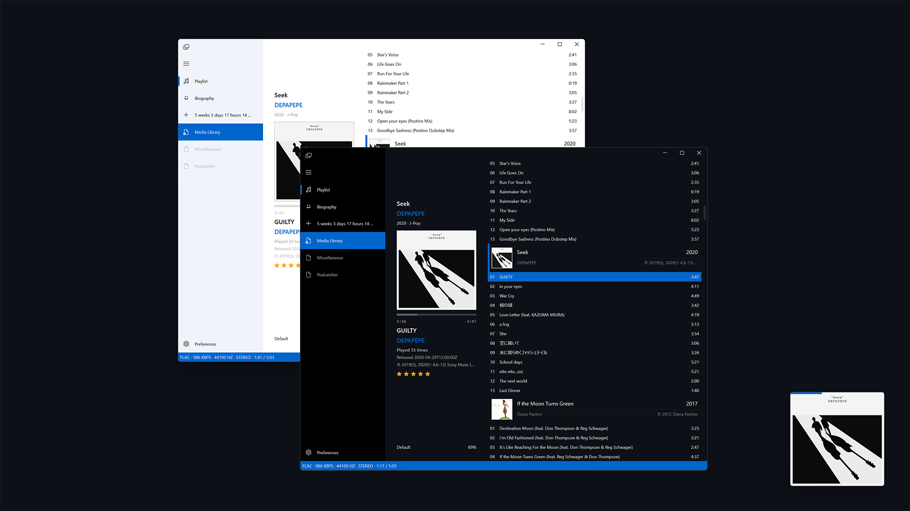

Vibe is a simple [Spdider Moneky Panel](https://github.com/TheQwertiest/foo_spider_monkey_panel) based foobar2000 theme (DUI).

## Components

* [ESLyric](https://github.com/ESLyric/release) (0.5.3)
* [Flowin](https://github.com/ttsping/foo_flowin) (0.2.0)
* [JSplitter](https://foobar2000.ru/forum/viewtopic.php?t=6378) (3.6.1)
* [Playback Statistics](https://www.foobar2000.org/components/view/foo_playcount) (3.1.3)
* UI Hacks (2013-02-19)

## Hotkeys

1. <kbd>Tab</kbd> Show/Hide group headers
2. <kbd>Ctrl</kbd>+<kbd>Tab</kbd> Collapse all group headers
3. <kbd>Shift</kbd>+<kbd>Tab</kbd> Expand all group headers
4. <kbd>Ctrl</kbd>+<kbd>B</kbd> Show/Hide scrollbar
5. <kbd>Ctrl</kbd>+<kbd>E</kbd> Show/Hide row stripes
6. <kbd>Ctrl</kbd>+<kbd>R</kbd> Show/Hide ratings
7. <kbd>Ctrl</kbd>+<kbd>T</kbd> Show/Hide filter box

## Notes

* If you have a lot of playlists to manage, apparently this theme is not for you. For me, I am just playing with one auto playlist.
* Some features of components are disabled by default in the theme, eg. _Desktop lyric_. You may need to turn it on by yourself manually.
* Biography cache files are stored in **C:\muzik\cache** by default. If you want to change the location, open **profile\user-scripts\yttm\biography.ini**, find and replace current location with yours.
* This theme is supported in foobar2000 32-bit version only for now.